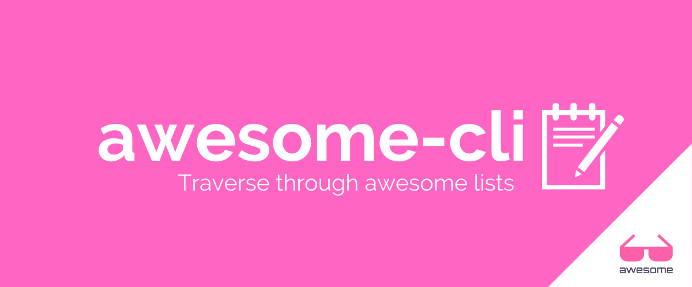

# awesome-cli

Awesome CLI is a simple command line tool to give you a fancy command line interface to dive into [Awesome](https://github.com/sindresorhus/awesome) lists.



 

---
<!-- START doctoc generated TOC please keep comment here to allow auto update -->
<!-- DON'T EDIT THIS SECTION, INSTEAD RE-RUN doctoc TO UPDATE -->


- [Introduction](#introduction)
- [How To Use](#how-to-use)
  - [Interactive Mode](#interactive-mode)
  - [Random Mode](#random-mode)
  - [Surprise Mode](#surprise-mode)
- [How To Install](#how-to-install)
  - [Basic](#basic)
  - [Build as binary](#build-as-binary)
  - [Download and use oficial binary](#download-and-use-oficial-binary)
  - [CLI Options](#cli-options)
  - [Sample Execution](#sample-execution)
- [How To Contribute](#how-to-contribute)

<!-- END doctoc generated TOC please keep comment here to allow auto update -->
---

## Introduction

The CLI starts with the root repository [sindresorhus/awesome](https://github.com/sindresorhus/awesome) and guides to to the final repo according to your choices. It fetches Readme files of the repositories and parses them to create the select lists. So, the CLI needs a working network :). It also uses file caches to cache the Readme file contents. You can find the cache folder with name ".awsomecache" under your home folder.


## How To Use

### Interactive Mode

In order to use awesome-cli interactively, just execute it without giving any option. You will walk through the categories and repositories by using "↓ ↑ → ←" buttons. Your choices will be saved to use them in [surprise mode](#surprise-mode).

```bash
> $ awesome-cli
Use the arrow keys to navigate: ↓ ↑ → ← 
? Select from 'Awesome' list: 
  ▸ Platforms
    Programming Languages
    Front-End Development
    Back-End Development
    Computer Science
    Big Data
    Theory
    Books
    Editors
↓   Gaming
```

### Random Mode

You can use "random" option to go a random awesome repository under a random category.

```bash
> $ awesome-cli random
aweome-cli Version 0.3.0
✔ Programming Languages
✔ Eta
✔ Community
✔ IRC
https://kiwiirc.com/client/irc.freenode.net/#eta-lang
```

### Surprise Mode

When you use "surprise" option, awesome-cli will use your previous selections in [interactive mode](#interactive-mode) to find a random repository for you.

```bash
> $ awesome-cli surprise
aweome-cli Version 0.3.0
✔ Back-End Development
✔ Docker
✔ Videos
✔ From Local Docker Development to Production Deployments
https://www.youtube.com/watch?v=7CZFpHUPqXw
```

## How To Install

### Basic

Follow the steps;

```bash
> $ git clone git@github.com:umutphp/awesome-cli.git
> $ cd awesome-cli
> $ go run main.go
```

### Build as binary

Follow the steps;

```bash
> $ git clone git@github.com:umutphp/awesome-cli.git
> $ cd awesome-cli
> $ sudo go build -o /usr/local/bin/awesome-cli .
> $ awesome-cli
```

### Download and use oficial binary

Visit the [latest release](https://github.com/umutphp/awesome-cli/releases/latest) page and download the binary correspondingly. 

```bash
> $ wget -O /usr/local/bin/awesome-cli https://latest-binary-url
> $ awesome-cli
```

### CLI Options

The CLI works in interactive mode without any given option. But, It can be also called some options described below;

```bash
> $ awesome-cli help
aweome-cli Version 0.2.0

Options of awesome-cli:
  help      To print this screen.
  random    To go to a random awesome content.
  surprise  To go to a surprise awesome content according to your previos choices.
```

### Sample Execution

```bash
> $ go run main.go
aweome-cli Version 0.2.0
✔ Platforms
✔ Linux
✔ Applications
✔ Gedit
https://wiki.gnome.org/Apps/Gedit
```

## How To Contribute
Please follow the instructions in [CONTRIBUTING](CONTRIBUTING.md) file and beware of [CODE_OF_CONDUCT](CODE_OF_CONDUCT).
